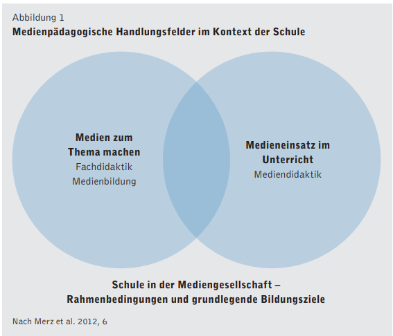
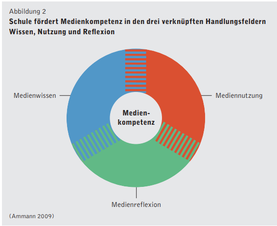

# 

## Mediendidaktik

## Austausch {background-color="var(--bg-activity)"}

### Think

Übungsaufgabe 1 Lesen Sie in @merz2012 [S. 7] die Beschreibung der Handlungsfelder.

### Pair

Besprechen Sie mit Ihrer Sitznachbarin in wiefern ihr Fachunterricht (nicht M&I) über Medien ist.
Suchen und besprechen Sie ein Beispiel von gutem Medieneinsatz im (eigenen) Unterricht.

### Share

## Triadisches Modell

## Was ist Informatik?

## Bibliographie